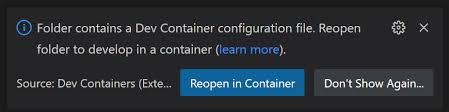
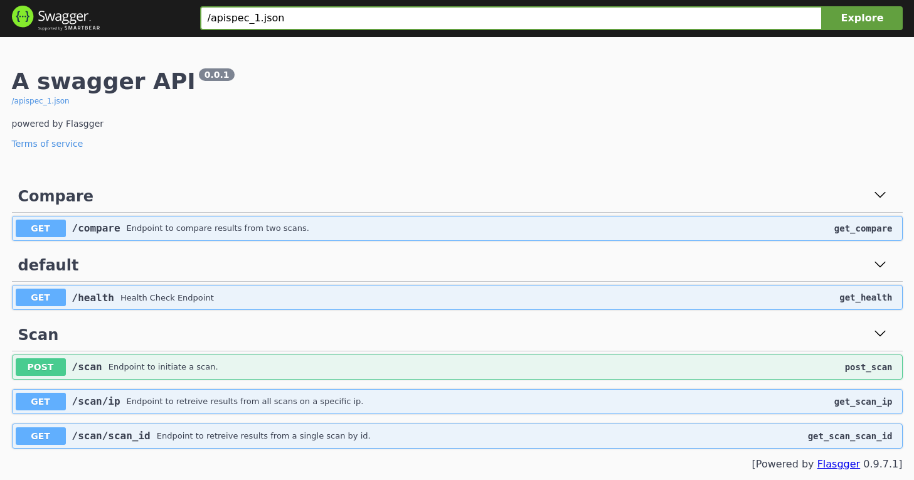
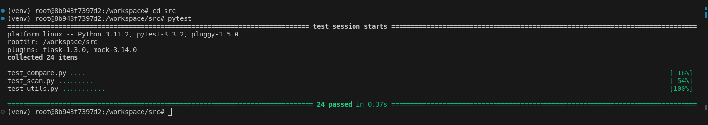

# Portscan

**IMPORTANT** Branch is incomplete.  Opensearch is running in the devcontainer but Makefile and Helm chart are not updated for kubernetes deployment.

**Description:** An API that scans for open ports on a set of IP addresses. Results returned in json. Results persist and are stored in database for later retreival by ip or scan_id.  Also, two scans may be compared via API.

**Development:(VS Code with Docker)**

* Clone this repository
* Open directory with VS Code
* Re-Open in container 
* API should be available at localhost:4000

**Usage:** Refer to swagger documentation: http://localhost:4000/apidocs


**src/ports2scan** contains ports to be scanned

**Tests:** Run ```pytest``` from the src directory.  When openning a terminal in VS Code it should already be in a venv with requirements installed from within the devcontainer.
